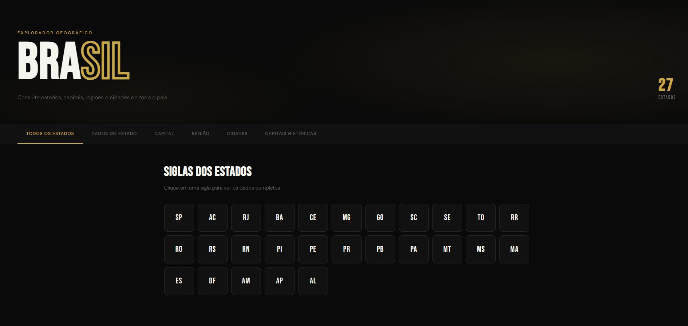

<div align="center">

# 🇧🇷 Brasil API

**API REST de Estados e Cidades do Brasil com interface visual interativa**


<br/>



</div>

---

## 📋 Índice

- [Sobre o Projeto](#-sobre-o-projeto)
- [Funcionalidades](#-funcionalidades)
- [Estrutura de Pastas](#-estrutura-de-pastas)
- [Pré-requisitos](#-pré-requisitos)
- [Instalação](#-instalação)
- [Como Usar](#-como-usar)
- [Endpoints da API](#-endpoints-da-api)
- [Interface Visual](#-interface-visual)
- [Tecnologias](#-tecnologias)
- [Autor](#-autor)

---

## 📖 Sobre o Projeto

A **Brasil API** é uma API REST local que fornece dados geográficos completos sobre os estados e cidades do Brasil. O projeto inclui um frontend interativo com tema escuro e dourado, onde é possível consultar todas as informações diretamente pelo navegador — sem precisar de ferramentas como Postman ou Insomnia.

> **Sobre o desenvolvimento:** As funções de manipulação de dados (`funcao.js`) e a lógica da API foram desenvolvidas por mim. O frontend (`index.html`, `style.css`, `js/app.js`) foi desenvolvido com auxílio de inteligência artificial, com o objetivo de proporcionar uma melhor experiência visual para o projeto.

> Projeto desenvolvido com fins educacionais, explorando conceitos de API REST, Node.js e consumo de dados via JavaScript.

---

## ✨ Funcionalidades

- ✅ Listar todas as siglas dos 27 estados brasileiros
- ✅ Consultar dados completos de um estado pela sigla
- ✅ Obter a capital de qualquer estado
- ✅ Filtrar estados por região (Norte, Nordeste, Centro-Oeste, Sudeste, Sul)
- ✅ Listar todas as cidades de um estado
- ✅ Consultar o histórico de capitais do Brasil
- ✅ Interface visual com abas, tema preto e dourado

---

## 📁 Estrutura de Pastas

```
API-Brasil/
│
├── 📁 api/                     → Servidor e frontend
│   ├── app.js                  → Servidor Express (rotas da API)
│   ├── index.html              → Interface visual
│   ├── style.css               → Estilos da interface
│   ├── package.json            → Dependências do projeto
│   ├── package-lock.json
│   └── 📁 js/
│       └── app.js              → JavaScript do frontend
│
└── 📁 dados/                   → Base de dados
    ├── estados_cidades.js      → JSON com todos os estados e cidades
    └── funcao.js               → Funções de manipulação dos dados
```

---

## ⚙️ Pré-requisitos

Antes de começar, certifique-se de ter instalado:

- [Node.js](https://nodejs.org/) — versão 18 ou superior
- Terminal (PowerShell, CMD ou bash)

Para verificar se o Node.js está instalado:

```bash
node -v
npm -v
```

---

## 🚀 Instalação

**1. Clone ou baixe o projeto**

```bash
git clone https://github.com/Brayan/brasil-api.git
```

Ou baixe o ZIP e extraia na sua área de trabalho.

**2. Acesse a pasta da API**

```bash
cd API-Brasil/api
```

**3. Instale as dependências**

```bash
npm install
```

**4. Inicie o servidor**

```bash
node app.js
```

Se tudo estiver correto, você verá:

```
✅ API rodando em http://localhost:3000

📌 Rotas disponíveis:
   GET /estados
   GET /estados/:uf
   GET /estados/:uf/capital
   GET /estados/:uf/cidades
   GET /regioes/:regiao
   GET /capital-pais
```

**5. Abra a interface no navegador**

Abra o arquivo `api/index.html` diretamente no navegador. A interface já se conecta automaticamente à API rodando em `localhost:3000`.

---

## 📡 Endpoints da API

Base URL: `http://localhost:3000`

---

### `GET /estados`
Lista as siglas de todos os estados brasileiros.

**Exemplo de requisição:**
```
GET http://localhost:3000/estados
```

**Resposta:**
```json
{
  "uf": ["AC", "AL", "AP", "AM", "BA", "..."],
  "quantidade": 27
}
```

---

### `GET /estados/:uf`
Retorna os dados completos de um estado.

| Parâmetro | Tipo   | Descrição              |
|-----------|--------|------------------------|
| `uf`      | string | Sigla do estado (ex: SP) |

**Exemplo de requisição:**
```
GET http://localhost:3000/estados/SP
```

**Resposta:**
```json
{
  "uf": "SP",
  "descricao": "Sao Paulo",
  "capital": "São Paulo",
  "regiao": "Sudeste"
}
```

---

### `GET /estados/:uf/capital`
Retorna a capital de um estado.

**Exemplo de requisição:**
```
GET http://localhost:3000/estados/RJ/capital
```

**Resposta:**
```json
{
  "uf": "RJ",
  "descricao": "Rio de Janeiro",
  "capital": "Rio de Janeiro"
}
```

---

### `GET /estados/:uf/cidades`
Lista todas as cidades de um estado.

**Exemplo de requisição:**
```
GET http://localhost:3000/estados/MS/cidades
```

**Resposta:**
```json
{
  "uf": "MS",
  "descricao": "Mato Grosso do Sul",
  "quantidade_cidades": 79,
  "cidades": ["Campo Grande", "Dourados", "..."]
}
```

---

### `GET /regioes/:regiao`
Lista todos os estados de uma região.

| Parâmetro | Valores aceitos |
|-----------|----------------|
| `regiao`  | `Norte`, `Nordeste`, `Centro-Oeste`, `Sudeste`, `Sul` |

**Exemplo de requisição:**
```
GET http://localhost:3000/regioes/Sul
```

**Resposta:**
```json
{
  "regiao": "Sul",
  "estados": [
    { "uf": "PR", "descricao": "Paraná" },
    { "uf": "SC", "descricao": "Santa Catarina" },
    { "uf": "RS", "descricao": "Rio Grande do Sul" }
  ]
}
```

---

### `GET /capital-pais`
Retorna o histórico de capitais do Brasil.

**Exemplo de requisição:**
```
GET http://localhost:3000/capital-pais
```

**Resposta:**
```json
{
  "capitais": [
    {
      "capital_atual": true,
      "uf": "DF",
      "descricao": "Distrito Federal",
      "capital": "Brasília",
      "regiao": "Centro-Oeste",
      "capital_pais_ano_inicio": 1960,
      "capitais_pais_ano_fim": null
    }
  ]
}
```

---

### Erros

Quando um recurso não é encontrado, a API retorna:

```json
{
  "erro": "Estado 'XX' não encontrado."
}
```

| Código | Significado         |
|--------|---------------------|
| `200`  | Sucesso             |
| `404`  | Recurso não encontrado |

---

## 🖥️ Interface Visual

A interface pode ser acessada abrindo o arquivo `index.html` no navegador enquanto a API estiver rodando.

### Abas disponíveis

| Aba | Descrição |
|-----|-----------|
| **Todos os Estados** | Grid com todas as siglas clicáveis |
| **Dados do Estado** | Busca por sigla com informações completas |
| **Capital** | Consulta a capital de qualquer estado |
| **Região** | Filtra estados por região com botões |
| **Cidades** | Lista todas as cidades de um estado |
| **Capitais Históricas** | Histórico de capitais do Brasil |

> 💡 Na aba "Todos os Estados", clique em qualquer sigla para ser redirecionado automaticamente com os dados preenchidos.

---

## 🛠️ Tecnologias

| Tecnologia | Uso |
|------------|-----|
| **Node.js** | Runtime JavaScript no servidor |
| **Express** | Framework para criação das rotas REST |
| **CORS** | Permite requisições do frontend ao servidor |
| **HTML5** | Estrutura da interface |
| **CSS3** | Estilização com variáveis e animações |
| **JavaScript (ES6+)** | Lógica do frontend e consumo da API |
| **Bebas Neue** | Fonte display da interface |
| **DM Sans** | Fonte de texto da interface |

---

## 👤 Autor

Desenvolvido por **Brayan**

- 🧠 **Lógica e back-end:** desenvolvidos manualmente — funções de manipulação de dados (`funcao.js`), rotas da API (`server.js`) e estrutura do projeto
- 🎨 **Frontend:** desenvolvido com auxílio de inteligência artificial para proporcionar uma melhor experiência visual ao projeto

---

<div align="center">

Feito com 💛 e Node.js

</div>